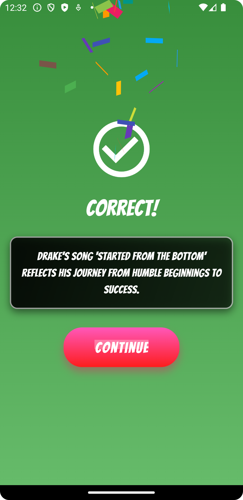

# Rap Lyrics Game

Rap Lyrics Game is an engaging quiz app where users guess the missing lyrics from popular rap songs. With a graffiti-style theme and fun animations, this game provides an exciting experience for hip-hop enthusiasts.

## Features

- **Start Screen:** Welcome screen with the graffiti-style theme.
- **Quiz Screen:** Interactive quiz interface where users select the correct lyrics.
- **Correct Screen:** Shows feedback for correct answers with sounds, confetti animation, and trivia about the song.
- **Score Screen:** Displays the user's final score after the game ends.

## Screenshots

### Start Screen  


### Quiz Screen  


### Correct Screen  


### Score Screen  


## How to Run

1. Clone this repository:
   ```bash
   git clone https://github.com/Cod-e-Codes/rap-lyrics-game.git
   ```

2. Navigate to the project directory:
   ```bash
   cd rap-lyrics-game
   ```

3. Navigate to the project directory:
   ```bash
   flutter pub get
   ```

4. Run the app on an emulator or connected device:
   ```bash
   flutter run
   ```

## Tools and Packages 🛠️
This app was built using **Flutter** and includes the following packages:
- **confetti**: For confetti animations.
- **audioplayers**: For sound effects.

## Contributing 🤝
Contributions are welcome! Please fork this repository and submit a pull request for any features or bug fixes.

## Developed by CodēCodes 🚀
Visit CodēCodes for more amazing projects:  
[Website](https://www.cod-e-codes.com/)  
[GitHub](https://github.com/Cod-e-Codes)